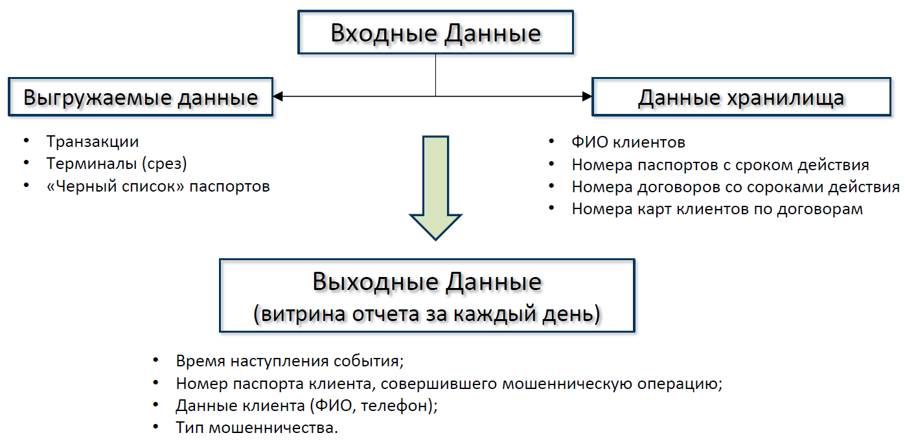
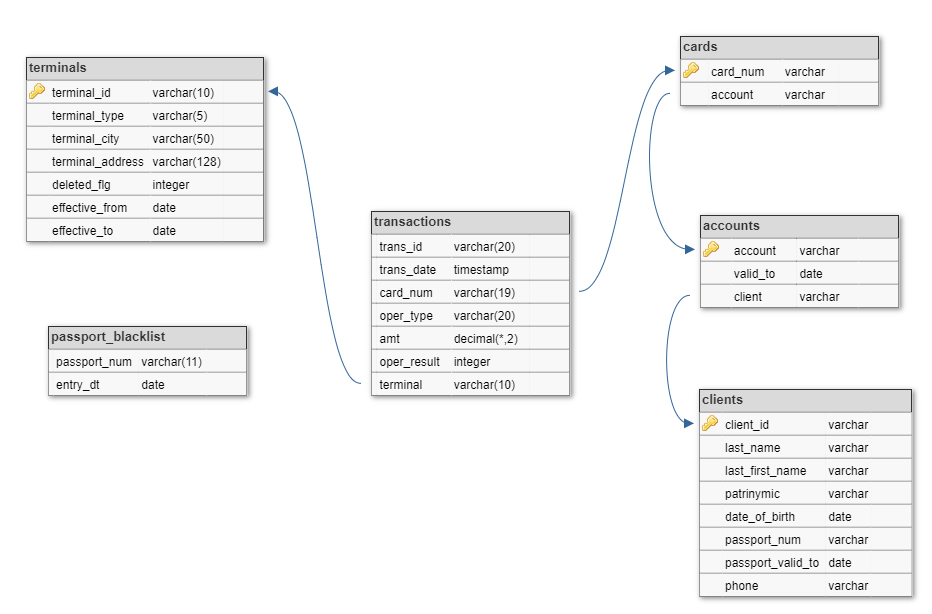

---
## 
Система автоматического поиска мошеннических операций 

### Описание задачи

  Разработка **ETL**-процесса, получающий ежедневную выгрузку данных, загружающий ее в хранилище и ежедневно строящий отчет  

### Выгружаемые данные

1. Список транзакций за текущий день -`.csv`.
2. Cписок терминало полным срезом -`.xlsx`.
3. Список паспортов, включенных в "черный список", с накоплением с начала месяца -`.xlsx`

### Структура хранилища

### Построение отчета

По результатам загрузки строится витрина отчетности `REP_FRAUD`, с накоплением, по следующим признакам мошеннических операций:  
1. Совершение операций при просроченном или заблокированном паспорте.
2. Совершение операций при недействующем договоре (карточного счета).
3. Совершение операций в разных городах в течении одного часа.
4. Попытка подбора суммы. В течении 20 минут проходит более 3х операций со следующим шаблоном - каждая последующая меньше предыдущей, при этом отклонены все кроме последней. Последняя операция в такой цепочке сичтается мошеннической.

### Особенности
1. Инструменты: `Orecle`, `Python`.  
  
  
2. Структура:  
  `main.py` - основной процесс обработки;  
  `tableMG.py` - функции выгрузки данных из файлов (терминалы, транзакции паспорта) в хранилище;  
  `dataProc.py` - функции выявления мошеннических операций и построения витрины отчетности;  
  `fileMG.py` - функции работы с файлами.  
  
  
3. Структрура пользовательского хранилища:  
  `s_20_DWH_FACT_PSSPRT_BLCKLST` - «черный» список паспортов;  
  `s_20_DWH_FACT_TRANSACTIONS` - таблица транзакций;  
  `s_20_DWH_DIM_TERMINALS_HIST` - таблица терминалов;  
  `s_20_REP_FRAUD` - витрина отчетности;  
  `s_20_META_TRAIN_LOAD` - таблица с планом отладки.  
   
   
4. Введен алгоритм автоматической отладки, активируется присвоением переменной `sel_mode = 1` (main.py): при активации в таблице `s_20_META_TRAIN_LOAD` создается план отладки ( 01.03.2021 --> 02.03.2021 --> 03.03.2021 ) с последующей автоматической обработкой соответствующих файлов согласно плана отладки. При переводе программы в рабочий режим `sel_mode = 0` происходит сброс плана (отчистка таблицы `s_20_META_TRAIN_LOAD`).  
  
  
5. Введен принцип толерантности к отсутствию каких либо файлов (терминалы, транзакции, паспорта): отсутствие файлов и (или) имя файла не соответствует заданному шаблону (ожидаемой дате). При выявлении такого случая программа выведет в терминал сообщение:  
 `!!!!! Файл [имя_файла] отсутствует !!!!!`  
 и продолжит свое выполнение.

### Пример витрины отчетности  
| event_dt | passport | FIO | phone | event_type | report_dt |
| :------: | :------: | --- | :---: | :--------: | :-------: |
| ...| | | | | |
| 2021-03-01 10:53:59 | 5428 324302 | Озерцов Нурлан Булатович | +7 920 636-76-84 | Подбор суммы | 2021-03-01 |
| 2021-03-02 00:16:34 | 5267 464227 | Шкабкина Анжелика Ивановна | +7 954 947-32-64 | Операции в разных городах в течении часа | 2021-03-02 |
| 2021-03-02 04:58:26 | 3042 452833 | Пначин Яков Богданович | +7 974 231-96-51 | Операция по заблокированному паспорту | 2021-03-02 |
| 2021-03-03 00:01:15 | 8135 165634 | Приемская Екатерина Анатольевна | +7 924 766-61-54 | Операция при недействующем договоре | 2021-03-03 |
| ... | | | | | |  

Где:  
`event_dt` - время наступления события;  
`passport ` - номер паспорта клиента;  
`fio` - ФИО клиента;  
`phone` - номер телефона клиента;  
`event_type`  - опиание типа мошенничества;  
`report_dt` - дата построения отчета.
